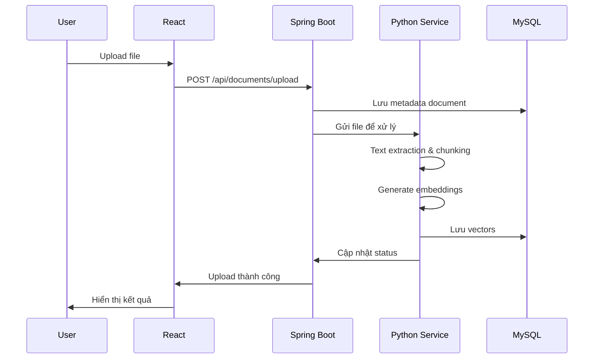
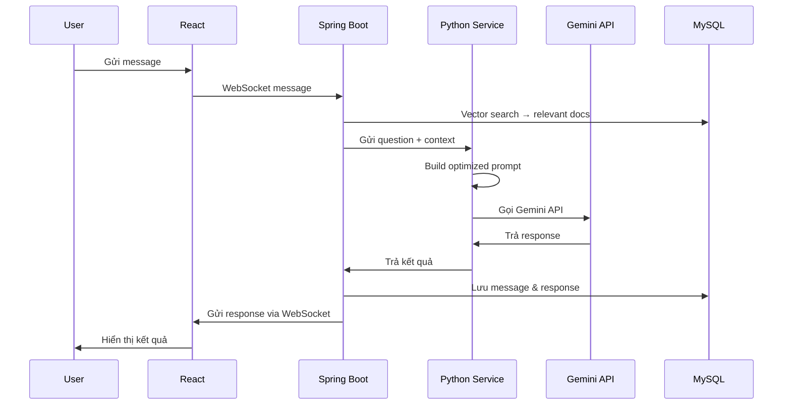
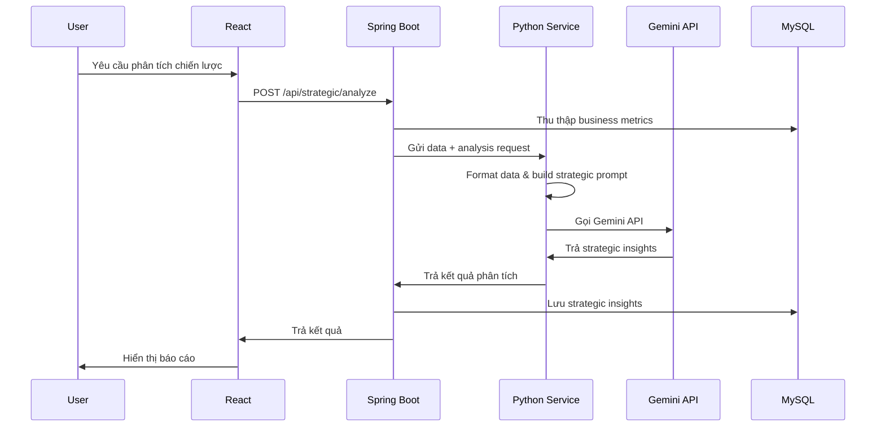

# 🤖 AI Agent for Business

> **Đồ Án Chuyên Ngành - Đại Học Trà Vinh**
> 
> Hệ thống AI thông minh hỗ trợ doanh nghiệp trong việc chăm sóc khách hàng, tư vấn sản phẩm và đề xuất chiến lược kinh doanh dựa trên dữ liệu nội bộ.
> 
> **Sinh viên thực hiện:** Nguyễn Văn Hoàng  
> **MSSV:** 110122078  
> **Khoa:** Công Nghệ Thông Tin  
> **Trường:** Đại Học Trà Vinh  
> **Giáo viên hướng dẫn:** ThS. TS. Nguyễn Bảo Ân

[](https://spring.io/projects/spring-boot)
[](https://nextjs.org/)
[](https://fastapi.tiangolo.com/)
[](https://www.python.org/)
[](https://openjdk.org/)

---

## 📋 Mục Lục

- [Tổng Quan](#-tổng-quan)
- [Kiến Trúc Hệ Thống](#-kiến-trúc-hệ-thống)
- [Thành Phần Chính](#-thành-phần-chính)
- [Chức Năng Chi Tiết](#-chức-năng-chi-tiết)
- [Luồng Hoạt Động](#-luồng-hoạt-động)
- [Công Nghệ Sử Dụng](#-công-nghệ-sử-dụng)
- [Cài Đặt & Chạy Dự Án](#-cài-đặt--chạy-dự-án)
- [Cấu Trúc Thư Mục](#-cấu-trúc-thư-mục)
- [API Documentation](#-api-documentation)
- [Đóng Góp](#-đóng-góp)

---

## 🎯 Tổng Quan

**AI Agent for Business** là một hệ thống AI đa chức năng được thiết kế để:

- 💬 **Chăm sóc khách hàng tự động** với chatbot thông minh
- 📚 **Tư vấn sản phẩm** dựa trên knowledge base nội bộ
- 📊 **Phân tích và đề xuất chiến lược kinh doanh** từ dữ liệu thực tế
- 🔍 **Tìm kiếm thông minh** với RAG (Retrieval-Augmented Generation)
- 📈 **Báo cáo tự động** với insights dựa trên AI

### Điểm Nổi Bật

✅ **Kiến trúc Microservices**: Tách biệt frontend, backend và AI service  
✅ **RAG-Powered**: Kết hợp tìm kiếm vector với Gemini AI  
✅ **Real-time Communication**: WebSocket cho chat tức thì  
✅ **Multi-format Support**: Xử lý PDF, DOC, DOCX, TXT, Excel  
✅ **Scalable & Secure**: JWT authentication, RBAC, Redis caching  

---

## 🏗️ Kiến Trúc Hệ Thống

```
┌─────────────────────────────────────────────────────────────────┐
│                         USER INTERFACE                          │
│                   Next.js 14 + TypeScript                       │
└───────────────────────────┬─────────────────────────────────────┘
                            │
                            │ REST API / WebSocket
                            │
┌───────────────────────────▼─────────────────────────────────────┐
│                      BACKEND SERVICE                            │
│                  Spring Boot 3.x + Java 17                      │
│  ┌──────────────┐ ┌──────────────┐ ┌──────────────────────┐   │
│  │   Document   │ │   Chatbot    │ │  Strategic Analysis  │   │
│  │  Management  │ │   Service    │ │       Service        │   │
│  └──────────────┘ └──────────────┘ └──────────────────────┘   │
└───────────┬─────────────────────┬────────────────────────┬─────┘
            │                     │                        │
            │                     │                        │
   ┌────────▼────────┐   ┌────────▼────────┐    ┌────────▼────────┐
   │  MySQL 8.0      │   │  Redis Cache    │    │   AI Service    │
   │  + Vector Store │   │  + Session Mgmt │    │  Python FastAPI │
   └─────────────────┘   └─────────────────┘    │  + Gemini API   │
                                                 │  + RAG Engine   │
                                                 └─────────────────┘
```

---

## 🧩 Thành Phần Chính

| Thành Phần | Công Nghệ | Chức Năng Chính |
|-----------|-----------|-----------------|
| **Frontend** | Next.js 14 + TypeScript | Giao diện người dùng, SSR/SSG, real-time chat |
| **Backend** | Spring Boot 3.x + Java 17 | Business logic, API, security, database |
| **AI Service** | Python 3.11 + FastAPI | Xử lý RAG, tích hợp Gemini API |
| **Database** | MySQL 8.0 + Vector Extensions | Lưu trữ dữ liệu và vector embeddings |
| **Cache** | Redis 7.x | Session management, caching |

---

## 🔧 Chức Năng Chi Tiết

### 1. 📁 Module Quản Lý Tài Liệu

#### Upload & Xử Lý Đa Định Dạng
- ✅ Hỗ trợ format: **PDF, DOC, DOCX, TXT, Excel**
- ✅ Tự động trích xuất văn bản và metadata
- ✅ **Chunking thông minh** theo ngữ nghĩa
- ✅ **Vector hóa** và lưu trữ tối ưu

#### Quản Lý Knowledge Base
- 🏷️ Phân loại theo **category**, **tags**
- 🔍 Tìm kiếm nâng cao: **full-text + vector search**
- 📝 Version control cho tài liệu
- 🔄 Bulk operations xử lý hàng loạt

---

### 2. 💬 Module Chatbot Thông Minh

#### RAG-Powered Conversations

**Luồng xử lý:**
```
1. User question → Spring Boot → Vector search → Tìm documents liên quan
2. Spring Boot → Python Service (gửi question + context)
3. Python Service → Gemini API → Generated response
4. Python Service → Spring Boot → React → User
```

#### Tính Năng Chat Nâng Cao
- ⚡ **Real-time messaging** với WebSocket
- 💾 **Conversation history** lưu trữ đầy đủ
- 😊 **Sentiment analysis** tự động
- ⚡ **Quick responses** với templates

---

### 3. 📊 Module Đề Xuất Chiến Lược

#### Phân Tích Dữ Liệu Kinh Doanh
- 📈 Thu thập metrics tự động
- 📉 Trend analysis theo thời gian
- 🔄 Comparative analysis với industry benchmarks

#### AI Strategic Insights
- 🎯 **SWOT analysis** tự động
- 🔍 **Market opportunity identification**
- ⚠️ **Risk assessment** và mitigation suggestions

#### Báo Cáo Thông Minh
- 📅 **Automated reporting** định kỳ
- 📊 **Custom report generation**
- 📉 **Data visualization** interactive

---

### 4. ⚙️ Module Quản Trị Hệ Thống

#### User & Role Management
- 👥 **Role-based access control (RBAC)**
- 📝 **Activity logging** và audit trails
- 🔐 **Session management** bảo mật

#### System Configuration
- 🤖 AI model settings linh hoạt
- 🔑 API keys management an toàn
- ⚡ Performance tuning parameters

---

## 🔄 Luồng Hoạt Động

### A. Luồng Upload & Xử Lý Tài Liệu



---

### B. Luồng Xử Lý Câu Hỏi Người Dùng



---

### C. Luồng Phân Tích Chiến Lược



---

## 💻 Công Nghệ Sử Dụng

### Backend Stack
- ☕ **Java 17** + **Spring Boot 3.2**
- 🔐 **Spring Security** + JWT Authentication
- 🗃️ **Spring Data JPA** + Hibernate
- 🐬 **MySQL 8.0** với vector extensions
- 🔄 **Redis** cho caching & session management
- 🔌 **WebSocket + STOMP** real-time communication

### AI Service Stack
- 🐍 **Python 3.11** + **FastAPI**
- 🤖 **Google Generative AI (Gemini API)**
- 🧠 **Sentence Transformers** cho embeddings
- 🐬 **MySQL Connector Python**
- ⚡ **Uvicorn** ASGI server

### Frontend Stack
- ⚛️ **Next.js 14** (App Router) + **TypeScript**
- 🔄 **Redux Toolkit** / **Zustand** state management
- 🎨 **Tailwind CSS** styling
- 🌐 **Axios** / **Fetch API** HTTP client
- ⚡ **Server Components** & **Client Components**
- 🔌 **WebSocket Client** real-time updates
- 📊 **Chart.js** / **Recharts** data visualization
- 🖼️ **Next.js Image Optimization**

### DevOps & Deployment
- 🐳 **Docker** + **Docker Compose**
- 📦 **Maven** build automation
- 🔧 **Git** version control
- 🚀 **CI/CD** ready

---

## 🚀 Cài Đặt & Chạy Dự Án

### Yêu Cầu Hệ Thống

- 🐳 Docker & Docker Compose
- ☕ Java 17+
- 🐍 Python 3.11+
- 📦 Node.js 18+
- 🔧 Maven 3.8+

### Cài Đặt Nhanh

#### 1️⃣ Clone Repository

```bash
git clone https://github.com/vanhoangtvu/AI-Agent-for-Business.git
cd AI-Agent-for-Business
```

#### 2️⃣ Cấu Hình Environment Variables

Tạo file `.env` ở thư mục root:

```bash
# Database Configuration
MYSQL_ROOT_PASSWORD=your_root_password
MYSQL_DATABASE=ai_agent_db
MYSQL_USER=ai_agent_user
MYSQL_PASSWORD=your_password

# Redis Configuration
REDIS_PASSWORD=your_redis_password

# JWT Configuration
JWT_SECRET=your_jwt_secret_key_here
JWT_EXPIRATION=86400000

# Gemini API Configuration
GEMINI_API_KEY=your_gemini_api_key_here

# Backend Configuration
SPRING_DATASOURCE_URL=jdbc:mysql://mysql:3306/ai_agent_db
SPRING_REDIS_HOST=redis
SPRING_REDIS_PORT=6379

# AI Service Configuration
PYTHON_SERVICE_URL=http://python-service:8000
```

#### 3️⃣ Chạy với Docker Compose

```bash
# Build và khởi động tất cả services
docker-compose up -d

# Kiểm tra logs
docker-compose logs -f

# Dừng services
docker-compose down
```

#### 4️⃣ Chạy Từng Service Riêng Lẻ

**Backend (Spring Boot):**
```bash
cd backend/SpringService
mvn clean install
mvn spring-boot:run
```

**AI Service (Python FastAPI):**
```bash
cd backend/pythonService
pip install -r requirements.txt
uvicorn main:app --reload --host 0.0.0.0 --port 8000
```

**Frontend (Next.js):**
```bash
cd frontend
npm install
npm run dev
```

### Truy Cập Ứng Dụng

- 🌐 **Frontend**: http://localhost:3000
- ⚙️ **Backend API**: http://localhost:8100
- 🤖 **AI Service API**: http://localhost:8000
- 📚 **API Docs (Swagger)**: http://localhost:8100/swagger-ui.html
- 📖 **FastAPI Docs**: http://localhost:8000/docs

---

## 📁 Cấu Trúc Thư Mục

```
AI-Agent-for-Business/
│
├── backend/
│   ├── SpringService/              # Spring Boot Backend
│   │   ├── src/
│   │   │   ├── main/
│   │   │   │   ├── java/
│   │   │   │   │   └── com/aiagent/
│   │   │   │   │       ├── config/          # Configuration classes
│   │   │   │   │       ├── controller/      # REST Controllers
│   │   │   │   │       ├── service/         # Business Logic
│   │   │   │   │       ├── repository/      # Data Access Layer
│   │   │   │   │       ├── model/           # Entity Models
│   │   │   │   │       ├── dto/             # Data Transfer Objects
│   │   │   │   │       ├── security/        # Security & JWT
│   │   │   │   │       └── websocket/       # WebSocket Config
│   │   │   │   └── resources/
│   │   │   │       ├── application.yml
│   │   │   │       └── application-prod.yml
│   │   │   └── test/
│   │   ├── pom.xml
│   │   └── Dockerfile
│   │
│   └── pythonService/              # Python AI Service
│       ├── app/
│       │   ├── __init__.py
│       │   ├── main.py             # FastAPI application
│       │   ├── config.py           # Configuration
│       │   ├── models/             # Data models
│       │   ├── services/
│       │   │   ├── rag_service.py       # RAG implementation
│       │   │   ├── gemini_service.py    # Gemini API integration
│       │   │   ├── embedding_service.py # Vector embeddings
│       │   │   └── document_processor.py # Document processing
│       │   ├── routers/            # API routes
│       │   └── utils/              # Utility functions
│       ├── requirements.txt
│       └── Dockerfile
│
├── frontend/                       # Next.js Frontend
│   ├── public/                    # Static assets
│   │   ├── images/
│   │   └── icons/
│   ├── src/
│   │   ├── app/                   # App Router (Next.js 14)
│   │   │   ├── layout.tsx         # Root layout
│   │   │   ├── page.tsx           # Home page
│   │   │   ├── (auth)/            # Auth routes group
│   │   │   │   ├── login/
│   │   │   │   └── register/
│   │   │   ├── dashboard/         # Dashboard routes
│   │   │   ├── chat/              # Chat routes
│   │   │   ├── documents/         # Document management
│   │   │   ├── strategic/         # Strategic analysis
│   │   │   └── api/               # API routes (optional)
│   │   ├── components/            # React components
│   │   │   ├── Chat/
│   │   │   ├── Document/
│   │   │   ├── Dashboard/
│   │   │   ├── Strategic/
│   │   │   └── Common/
│   │   ├── lib/                   # Libraries & utilities
│   │   │   ├── api/               # API clients
│   │   │   ├── hooks/             # Custom hooks
│   │   │   └── utils/             # Utility functions
│   │   ├── store/                 # State management
│   │   │   ├── slices/            # Redux slices
│   │   │   └── store.ts           # Store configuration
│   │   ├── types/                 # TypeScript types
│   │   └── styles/                # Global styles
│   │       └── globals.css
│   ├── package.json
│   ├── next.config.js
│   ├── tsconfig.json
│   ├── tailwind.config.js
│   └── Dockerfile
│
├── docker-compose.yml
├── .env.example
├── .gitignore
└── README.md
```

---

## 📚 API Documentation

### Backend REST API Endpoints

#### Authentication
```
POST   /api/auth/register          # Đăng ký tài khoản
POST   /api/auth/login             # Đăng nhập
POST   /api/auth/refresh           # Refresh token
POST   /api/auth/logout            # Đăng xuất
```

#### Document Management
```
POST   /api/documents/upload       # Upload tài liệu
GET    /api/documents              # Lấy danh sách tài liệu
GET    /api/documents/{id}         # Lấy chi tiết tài liệu
PUT    /api/documents/{id}         # Cập nhật tài liệu
DELETE /api/documents/{id}         # Xóa tài liệu
POST   /api/documents/search       # Tìm kiếm tài liệu
```

#### Chatbot
```
POST   /api/chat/message           # Gửi message
GET    /api/chat/history           # Lấy lịch sử chat
GET    /api/chat/conversations     # Lấy danh sách conversations
DELETE /api/chat/{id}              # Xóa conversation
WS     /ws/chat                    # WebSocket endpoint
```

#### Strategic Analysis
```
POST   /api/strategic/analyze      # Phân tích chiến lược
GET    /api/strategic/reports      # Lấy danh sách báo cáo
GET    /api/strategic/reports/{id} # Lấy chi tiết báo cáo
POST   /api/strategic/metrics      # Cập nhật metrics
GET    /api/strategic/insights     # Lấy insights
```

#### User Management
```
GET    /api/users                  # Lấy danh sách users (Admin)
GET    /api/users/{id}             # Lấy thông tin user
PUT    /api/users/{id}             # Cập nhật user
DELETE /api/users/{id}             # Xóa user (Admin)
PUT    /api/users/{id}/roles       # Cập nhật roles (Admin)
```

---

### AI Service API Endpoints

#### Document Processing
```
POST   /api/v1/documents/process   # Xử lý document
POST   /api/v1/documents/embed     # Generate embeddings
```

#### RAG Service
```
POST   /api/v1/rag/query           # RAG query
POST   /api/v1/rag/search          # Vector search
```

#### Gemini Integration
```
POST   /api/v1/gemini/chat         # Chat với Gemini
POST   /api/v1/gemini/analyze      # Phân tích với Gemini
```

---

## 🔐 Authentication & Security

### JWT Token Flow

```
1. User login → Backend validates credentials
2. Backend generates JWT access token + refresh token
3. Frontend stores tokens (secure storage)
4. All API calls include: Authorization: Bearer {token}
5. Token expires → Use refresh token to get new access token
```

### Role-Based Access Control (RBAC)

| Role | Permissions |
|------|-------------|
| **ADMIN** | Full system access, user management, all operations |
| **MANAGER** | View all data, create/edit documents, generate reports |
| **USER** | View own data, upload documents, use chatbot |
| **GUEST** | Limited read-only access |

---

## 🧪 Testing

### Backend Tests
```bash
cd backend/SpringService
mvn test
mvn verify
```

### AI Service Tests
```bash
cd backend/pythonService
pytest
pytest --cov=app tests/
```

### Frontend Tests
```bash
cd frontend
npm test              # Run Jest tests
npm run test:e2e     # Run Playwright E2E tests
npm run test:coverage
```

---

## 📊 Performance & Monitoring

### Key Metrics
- ⚡ API Response Time: < 200ms
- 🔍 Vector Search: < 100ms
- 💬 Chat Response: < 2s
- 📁 Document Processing: < 5s per file

### Monitoring Tools
- **Spring Boot Actuator**: Health checks, metrics
- **Redis Monitor**: Cache hit rates
- **MySQL Slow Query Log**: Database optimization
- **Application Logs**: Centralized logging

---

## 🛠️ Troubleshooting

### Common Issues

#### 1. Database Connection Failed
```bash
# Kiểm tra MySQL service
docker-compose ps mysql

# Xem logs
docker-compose logs mysql

# Restart service
docker-compose restart mysql
```

#### 2. Gemini API Error
```bash
# Kiểm tra API key
echo $GEMINI_API_KEY

# Test API connection
curl -X POST https://generativelanguage.googleapis.com/v1/models/gemini-pro:generateContent \
  -H "Content-Type: application/json" \
  -H "x-goog-api-key: $GEMINI_API_KEY"
```

#### 3. WebSocket Connection Failed
```bash
# Kiểm tra CORS configuration
# Check application.yml: allowed-origins

# Test WebSocket endpoint
wscat -c ws://localhost:8080/ws/chat
```

---

## 🚧 Roadmap

### Phase 1 (Current) ✅
- [x] Basic infrastructure setup
- [x] Document management
- [x] Simple chatbot
- [x] User authentication

### Phase 2 (In Progress) 🚧
- [ ] Advanced RAG implementation
- [ ] Strategic analysis module
- [ ] Real-time notifications
- [ ] Advanced reporting

### Phase 3 (Planned) 📋
- [ ] Multi-language support (i18n)
- [ ] Voice interaction
- [ ] Mobile app (React Native / PWA)
- [ ] Advanced analytics dashboard
- [ ] Integration with popular CRM systems
- [ ] Edge Runtime optimization

---

## 🤝 Đóng Góp

Chúng tôi hoan nghênh mọi đóng góp! Vui lòng:

1. Fork repository
2. Tạo branch mới (`git checkout -b feature/AmazingFeature`)
3. Commit changes (`git commit -m 'Add some AmazingFeature'`)
4. Push to branch (`git push origin feature/AmazingFeature`)
5. Mở Pull Request

### Code Style Guidelines
- **Java**: Follow Google Java Style Guide
- **Python**: Follow PEP 8
- **TypeScript/Next.js**: Follow Airbnb Style Guide + Next.js Best Practices
- **Commit Messages**: Follow Conventional Commits

---

## 📄 License

This project is licensed under the MIT License - see the [LICENSE](LICENSE) file for details.

---

## 👥 Thông Tin Đồ Án

### Sinh Viên Thực Hiện
- **Họ và tên:** Nguyễn Văn Hoàng
- **MSSV:** 110122078
- **Lớp:** Kỹ Thuật Công Nghệ
- **Khoa:** Công Nghệ Thông Tin
- **Trường:** Đại Học Trà Vinh

### Giáo Viên Hướng Dẫn
- **Họ và tên:** ThS. TS. Nguyễn Bảo Ân
- **Khoa:** Công Nghệ Thông Tin

### Đề Tài
**Xây dựng hệ thống AI Agent hỗ trợ doanh nghiệp chăm sóc khách hàng và đề xuất chiến lược**  
(AI Agent for Business)

---

## 📧 Liên Hệ

- **Sinh viên:** Nguyễn Văn Hoàng
- **Email:** 110122078@st.tvu.edu.vn
- **GitHub:** [@vanhoangtvu](https://github.com/vanhoangtvu)
- **Trường:** Đại Học Trà Vinh
- **Repository:** [AI-Agent-for-Business](https://github.com/vanhoangtvu/AI-Agent-for-Business)
- **Issues:** [GitHub Issues](https://github.com/vanhoangtvu/AI-Agent-for-Business/issues)

---

## 🙏 Acknowledgments

- [Spring Boot](https://spring.io/projects/spring-boot)
- [Next.js](https://nextjs.org/)
- [FastAPI](https://fastapi.tiangolo.com/)
- [Google Generative AI](https://ai.google.dev/)
- [Sentence Transformers](https://www.sbert.net/)
- [Vercel](https://vercel.com/) - Next.js creators

---

<div align="center">

**Đồ Án Chuyên Ngành - Made with ❤️ by Nguyễn Văn Hoàng**

🎓 Đại Học Trà Vinh - Khoa Công Nghệ Thông Tin

⭐ Star us on GitHub — it helps!

[Report Bug](https://github.com/vanhoangtvu/AI-Agent-for-Business/issues) · [Request Feature](https://github.com/vanhoangtvu/AI-Agent-for-Business/issues)

---

© 2024-2025 Nguyễn Văn Hoàng - Đại Học Trà Vinh

</div>

